# Bezier Curve 1

## (1)
- ### (i) Plot the curves (m = 3)

cpoly1 = [0 1 2 3; 0 4 5 0]; cpoly2 = [0 1 3 4;-2 2 -2 0]; cpoly3 = [3 0 4 1; 0 3 3 0]; cpoly4 = [4 0 4 0; 0 1 1 0]; cpoly5 = [4 0 6 2; 0 6 6 0]

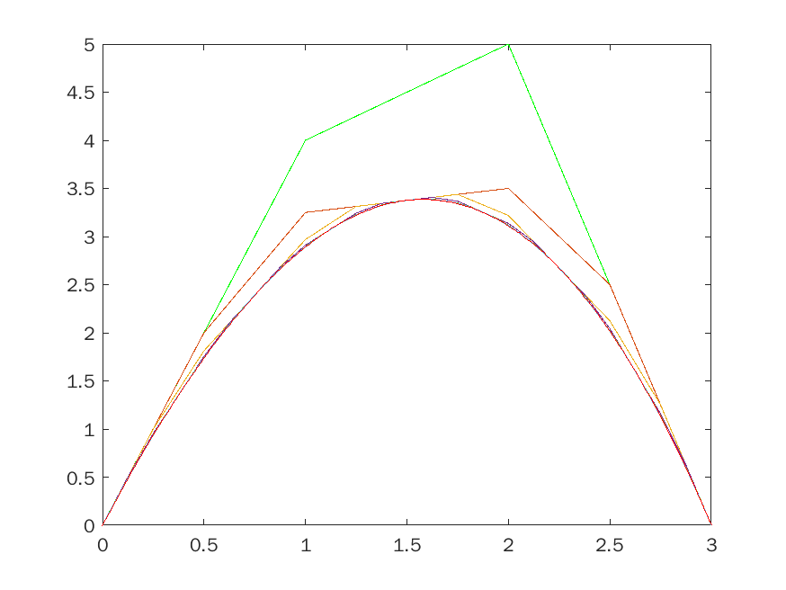
*cpoly1*

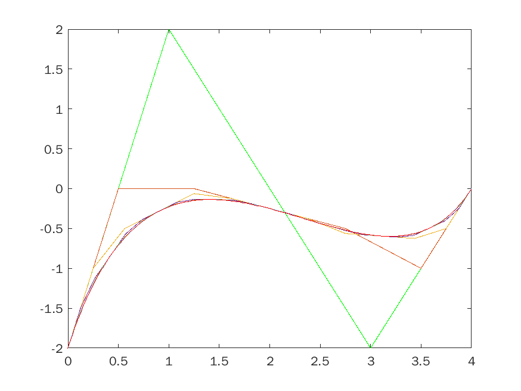
*cpoly2*

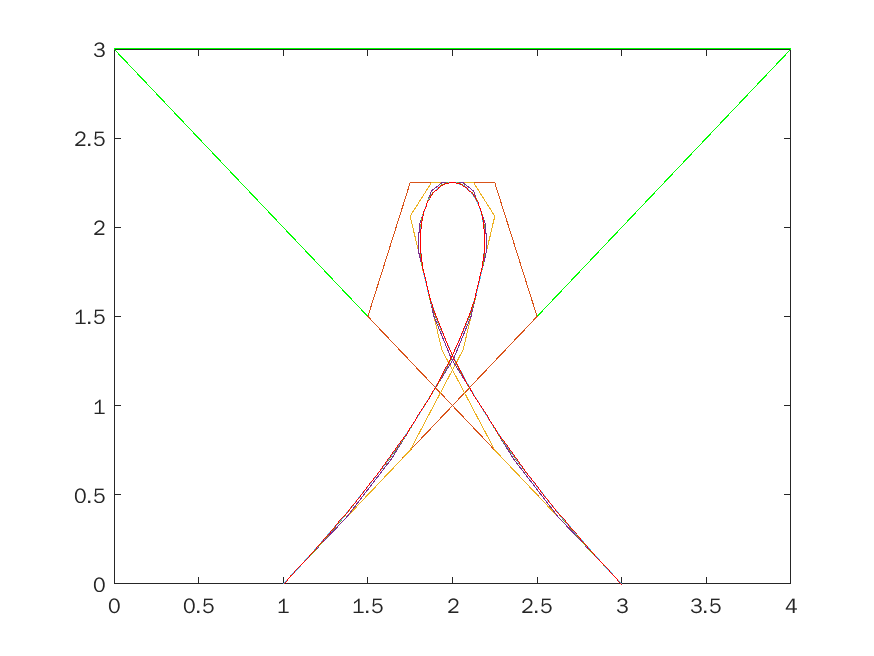
*cpoly3*

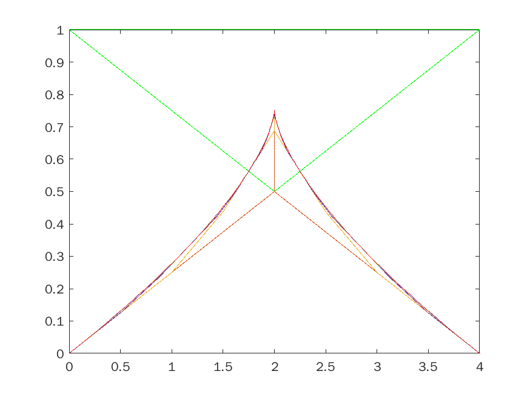
*cpoly4*

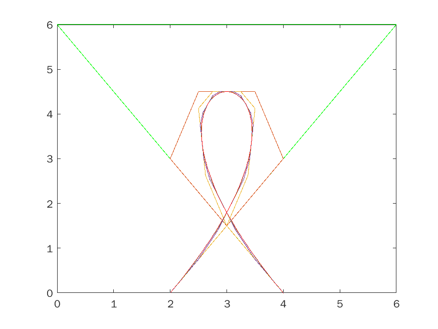
*cpoly5*

- ### (ii) Plot the curve by clicking on our own points
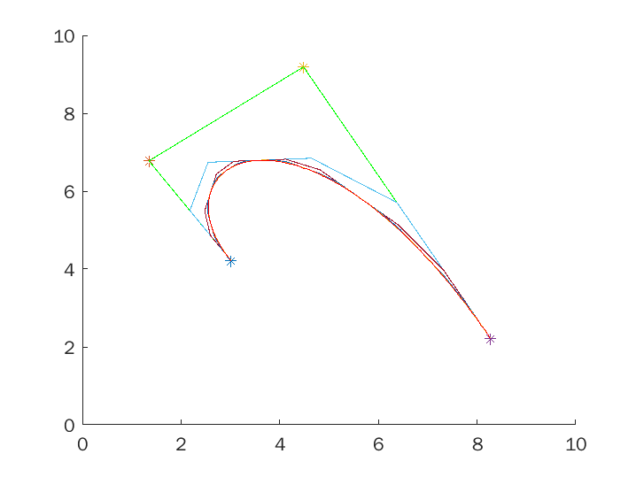
getpoints

## (2)
- ### (i) Plot these curves (m = 7)
cpoly1 = [1 2 3 4 5 6; 0 4 3 6 4 0]; cpoly2 = [2:9255 0:9333 2:6161 6:6779 9:0571 7:1809; 1:7041 3:9307 7:2510 7:7979 4:4385 2:0361]; cpoly3 = [1:3832 9:7044 4:9161 1:6460 7:2664 8:9307 7:2372 3:8650; 0:9768 8:9458 9:8064 8:7565 0:6325 1:3554 5:4174 3:9716]; cpoly4 = [7:6168 5:7044 1:6606 1:6168 4:2445 5:8212 8:7847 9:4124 8:0693; 1:8029 1:3726 2:6807 6:0542 9:0835 6:4673 4:6773 7:2418 9:3417]; cpoly5 = [7:1058 9:7190 7:3540 4:2591 8:6825 4:7263 0:8577 3:9964 2:9599 1:5438 5:2664; 8:1196 5:4002 2:3881 5:1936 7:2590 0:4088 9:4621 9:7031 7:1386 3:7478 7:7926]

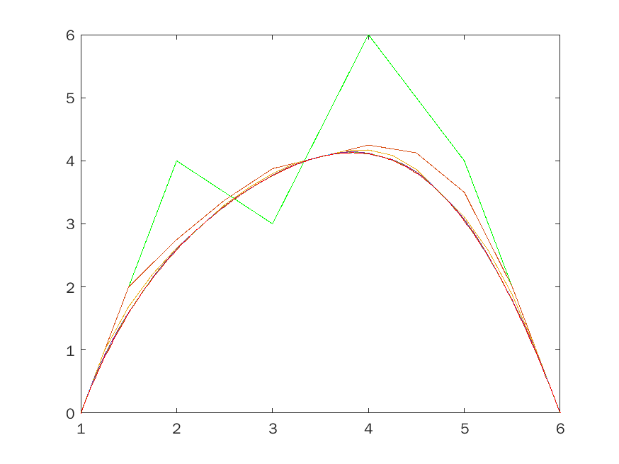
cpoly1

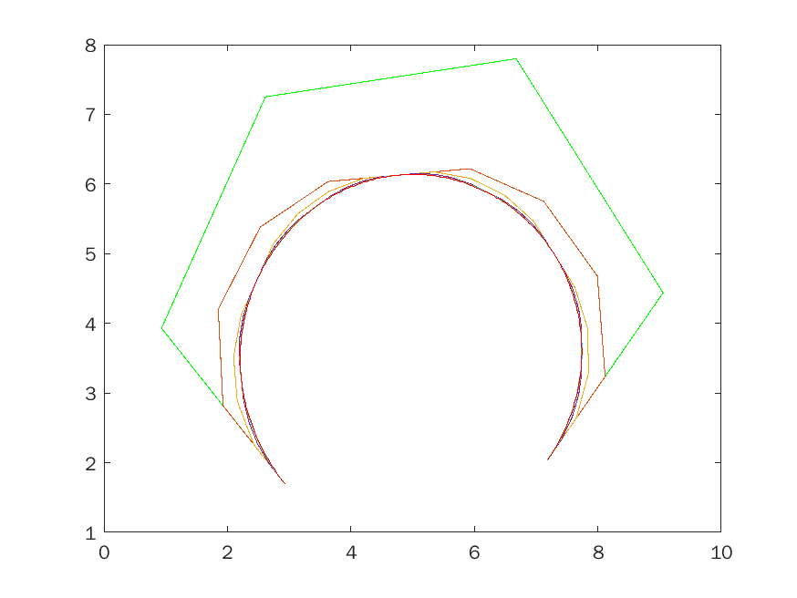
cpoly2

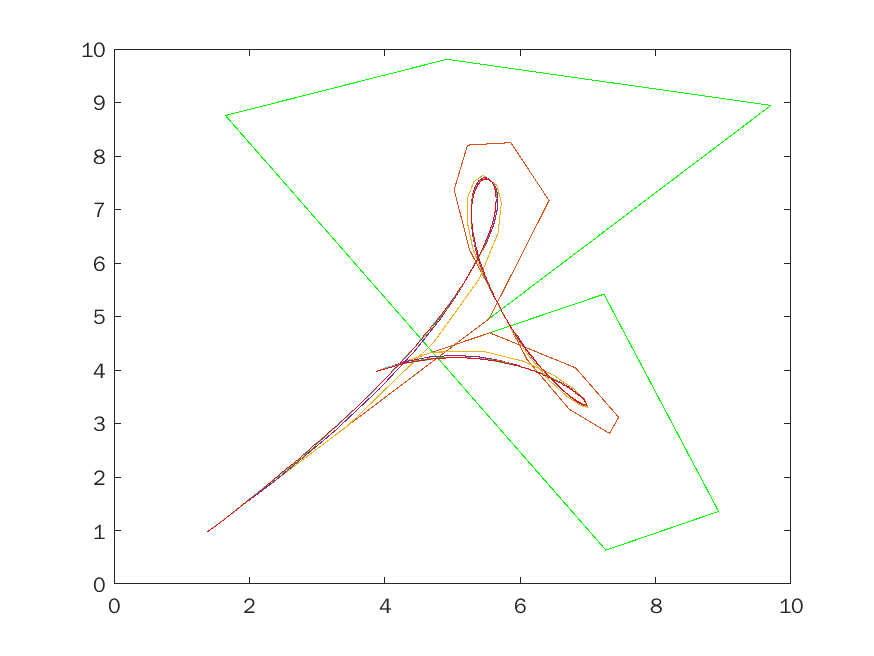
cpoly3

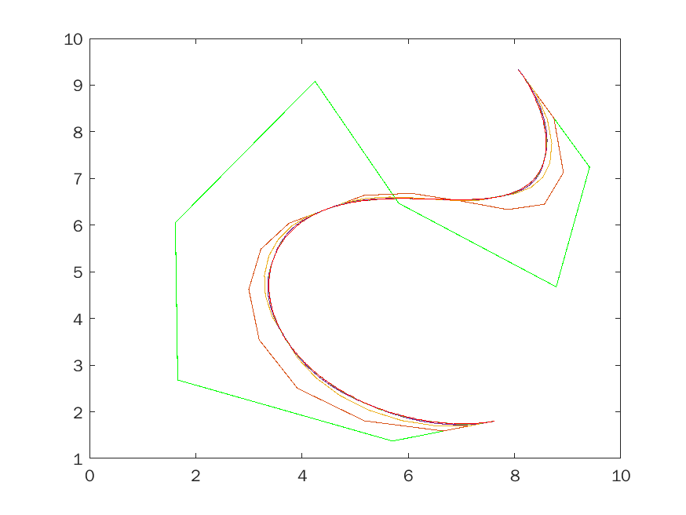
cpoly4

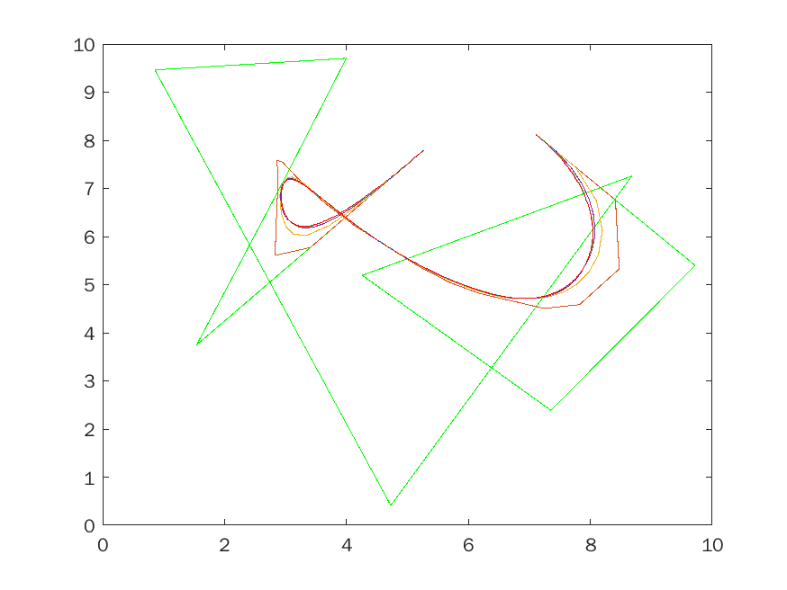
cpoly5

- ### (ii) Plot the curve by clicking on our own points (more than 5 points).
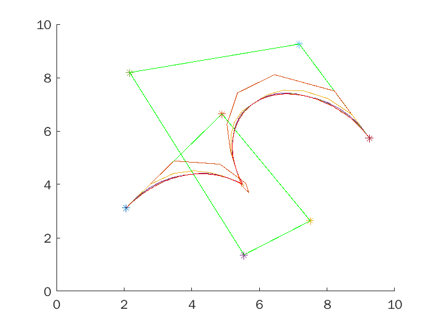
getpoints
